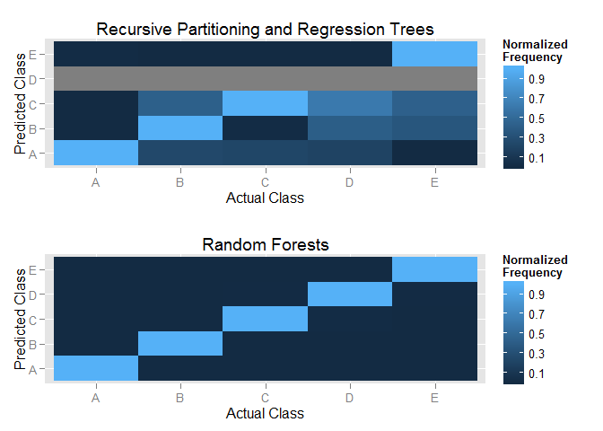

# Machine Learning Weight Lifting Exercise
Jared Endicott  
Sunday, November 22, 2015  

## Introduction

There are many wearable wireless devices on the market today which allow the user to measure various forms of physical activity. These devices are used to track the quantity of a particular exercise, such as steps taken or the amount of times a weight is lifted. What is not analyze as often is the quality of the execise, how well it is performed.

The goal of this report is to analyze a set of data from 6 participants as they lift weights. The data is from accelerometers on the belt, forearm, arm, and dumbell of the participants. The participants were given instructions on lifting barbells correctly and incorrectly five different ways. These outcomes are tracked with the variable classe. The purpose of the project is to build a predictive model from a training data set, which can then be used to predict the outcomes on subsequent data sets.  

## Getting, Cleaning and Preprocessing the Data

The first thing to do is set the seed so that the analysis and model building can be reproduced.Next we load all of the various libraries we will be using. Then we import the data frames for the training and testing sets.


```r
## Set the seed
set.seed(1188)

## Load packages
library(tidyr); library(caret); library(ggplot2); library(data.table)
library(GGally); library(gridExtra); library(rpart); library(rpart); 
library(gbm); library(survival); library(klaR); library(MASS)
library(ipred); library(plyr); library(dplyr)

## Download the raw data csv files and load into data tables
train.file <- "https://d396qusza40orc.cloudfront.net/predmachlearn/pml-training.csv"
test.file <- "https://d396qusza40orc.cloudfront.net/predmachlearn/pml-testing.csv"
training <- data.table(read.csv(train.file))
testing <- read.csv(test.file)
```

Since a model will not be able to predict with columns in the testing set that are NA there is no reason to include these columns in the testing or training sets. Additionally, the fields used for numbering, timestamps, and other logisitics do not make suitable features for prediction, because they can be unnaturally correlated with the classification variable and can confound the model design.


```r
## Preprocess by removing columns from training that are 
## completely NA in testing set or are related to time, order, etc
testing.clean <- testing[ ,colSums(is.na(testing)) < nrow(testing)]
testing.final <- testing.clean[ ,!names(testing.clean) %in% 
        c("X","problem_id","raw_timestamp_part_1","raw_timestamp_part_2",
          "cvtd_timestamp","new_window","num_window")]
training.clean <- training[ ,c("classe", names(testing.final)), with=FALSE]
```

In order to avoid overfitting it is best to partition the original training data into training (60%), validation (20%), and testing (20%) data sets. We will use the training set to traing and build the models. The validation set will be used to test each model and compare the model results from each model to determine which one works best at predicting data. The testing set will be used one time to test the final model that is selected in order to gauge the out of sample error. In addition we will be training each model using cross validation. These steps should ensure that the model we choose doesn't overfit the data and thus perform poorly on new data.


```r
## Partition original training dataset into 3 datasets, 
## training.model (40%), validation.model (20%), and testing.model (20%)
inTrain <- createDataPartition(y=training.clean$classe,
        p=0.60, list=FALSE)
training.model <- as.data.frame(training.clean)[inTrain,]
holdout <- as.data.frame(training.clean)[-inTrain,]
inTest <- createDataPartition(y=holdout $classe,
        p=0.50, list=FALSE)
validation.model <- as.data.frame(holdout)[inTest,]
testing.model <- as.data.frame(holdout)[-inTest,]
```

There is a predictor variable called user_name which is a qualitative factor variable. Qualitative variables are tricky for prediction algorithms to model, so a useful step is to transform the factor variable into new quantiative dummy variables that indicate a 1 or 0 if that factor level is in effect on the record. For this factor there are five levels, so this will create five new dummy variables. We apply this change to all of the data sets.


```r
## Transform the user_name column into dummy variables on each data set
dummies <- dummyVars(~ user_name, data=training.model)
training.model <- cbind(training.model, predict(dummies, newdata=training.model))

dummies <- dummyVars(~ user_name, data=validation.model)
validation.model <- cbind(validation.model, predict(dummies, newdata=validation.model))

dummies <- dummyVars(~ user_name, testing.model)
testing.model <- cbind(testing.model, predict(dummies, newdata=testing.model))

dummies <- dummyVars(~ user_name, data=testing.final)
testing.final <- cbind(testing.final, predict(dummies, newdata=testing.final))
```

## Building the Model

First we will create an object for the trainControl function with the repeatedcv method that will allow us to build each model using cross valiation. Next we build four different models using the following methods, a classification tree algorithm, a bagging algorithm, a random forest algorithm, and a boosting algorithm. These methods were selected for testing because they are suitable for predicting qualitative classification variables and thus have the best bet of performing well on our data. After builing the models we will view the results from each one in order to get a sense of which model will perform the best.


```r
## Set up cross validation with trainControl parameter function
fitControl <- trainControl(method = "repeatedcv",number=10,repeats=10)
```

Build a model using the Recursive Partitioning and Regression Trees algorithm.


```r
## Training models
model.rpart <- train(classe ~ ., data=training.model,
        method="rpart",trControl = fitControl)
```

Build a model using the Recursive Partitioning and Regression Trees algorithm.


```r
model.treebag <- train(classe ~ ., data=training.model, 
        method="treebag",trControl = fitControl)
```

Build a model using the Tree Bag algorithm.


```r
model.rf <- train(classe ~ ., data=training.model,
        method="rf",trControl = fitControl)
```

Build a model using the Generalized Boosted Regression Models algorithm.


```r
model.gbm <- train(classe ~ ., data=training.model,
        method="gbm",trControl = fitControl)
```

View the results from each model.


```r
model.rpart$results
```

```
##           cp  Accuracy      Kappa AccuracySD    KappaSD
## 1 0.03749407 0.5163221 0.37615584 0.02637646 0.04305530
## 2 0.05936561 0.4167445 0.21043883 0.06078226 0.10277031
## 3 0.11402468 0.3202526 0.05478924 0.03847928 0.05858741
```

```r
model.treebag$results
```

```
##   parameter Accuracy     Kappa  AccuracySD     KappaSD
## 1      none 0.983118 0.9786446 0.004081956 0.005165088
```

```r
model.rf$results
```

```
##   mtry  Accuracy     Kappa  AccuracySD     KappaSD
## 1    2 0.9868288 0.9833355 0.003570264 0.004518625
## 2   32 0.9902682 0.9876894 0.002890732 0.003657710
## 3   63 0.9854278 0.9815657 0.003803618 0.004813224
```

```r
model.gbm$results
```

```
##   shrinkage interaction.depth n.minobsinnode n.trees  Accuracy     Kappa
## 1       0.1                 1             10      50 0.7520121 0.6855833
## 4       0.1                 2             10      50 0.8565463 0.8182459
## 7       0.1                 3             10      50 0.8964917 0.8689611
## 2       0.1                 1             10     100 0.8224766 0.7753179
## 5       0.1                 2             10     100 0.9064698 0.8816284
## 8       0.1                 3             10     100 0.9406847 0.9249381
## 3       0.1                 1             10     150 0.8551200 0.8166465
## 6       0.1                 2             10     150 0.9311563 0.9128803
## 9       0.1                 3             10     150 0.9607768 0.9503743
##    AccuracySD     KappaSD
## 1 0.012099059 0.015350698
## 4 0.010163263 0.012889442
## 7 0.008027782 0.010145011
## 2 0.011460903 0.014462614
## 5 0.007723944 0.009772859
## 8 0.006988898 0.008839299
## 3 0.009260200 0.011713781
## 6 0.006998317 0.008854070
## 9 0.005960323 0.007542860
```

Based on the results from the four models we attempted the most promising models are Tree Bag, Random Forests, and Generalized Boosted Regression Models. It is helpful to compare these models using out of sample accuracy by predicting the outcomes on an independent validation data set. 


```r
predict.rpart <- predict(model.rpart,newdata=validation.model)
predict.treebag <- predict(model.treebag,newdata=validation.model)
predict.rf <- predict(model.rf,newdata=validation.model)
```

```
## Loading required package: randomForest
```

```
## Warning: package 'randomForest' was built under R version 3.2.2
```

```
## randomForest 4.6-12
## Type rfNews() to see new features/changes/bug fixes.
## 
## Attaching package: 'randomForest'
## 
## The following object is masked from 'package:dplyr':
## 
##     combine
```

```r
predict.gbm <- predict(model.gbm,newdata=validation.model)
```

We can compare the predictions made by each model to the actual results in the validation set by builing confusion matrices. We can compare the accuracy for each model on the validation data to determine which one we should use.


```r
cm.rpart <- confusionMatrix(predict.rpart, validation.model$classe)
cm.treebag <- confusionMatrix(predict.treebag, validation.model$classe)
cm.rf <- confusionMatrix(predict.rf, validation.model$classe)
cm.gbm <- confusionMatrix(predict.gbm, validation.model$classe)

models.accuracy <- c(cm.rpart[[3]][1], cm.treebag[[3]][1], cm.rf[[3]][1], 
        cm.gbm [[3]][1])
names(models.accuracy) <- c("Recursive Partitioning and Regression Trees", 
        "Tree Bag", "Random Forests", "Generalized Boosted Regression Models")

models.accuracy
```

```
## Recursive Partitioning and Regression Trees 
##                                   0.4947744 
##                                    Tree Bag 
##                                   0.9854703 
##                              Random Forests 
##                                   0.9910783 
##       Generalized Boosted Regression Models 
##                                   0.9615090
```

We can visualize and compare the models using the data from the confusion matrices. Below is a comparison of the Recursive Partitioning and Regression Trees to the Random Forests. You can see that the Random Forests model performs much better for this classification challenge.


```r
normalize <- function(x) { 
        x <- sweep(x, 2, apply(x, 2, min)) 
        sweep(x, 2, apply(x, 2, max), "/") 
} 

ctable <- as.table(matrix(c(cm.rpart$table), nrow = 5, byrow = TRUE)) 
input.matrix <- data.matrix(ctable) 
input.matrix.normalized <- normalize(input.matrix) 
 
colnames(input.matrix.normalized) = c("A", "B", "C", "D", "E") 
rownames(input.matrix.normalized) = colnames(input.matrix.normalized) 
confusion <- as.data.frame(as.table(input.matrix.normalized)) 
 
g1 <- ggplot(confusion) 
g1 <- g1 + geom_tile(aes(x=Var1, y=Var2, fill=Freq)) +
ggtitle("Recursive Partitioning and Regression Trees") +
scale_x_discrete(name="Actual Class") +
scale_y_discrete(name="Predicted Class") +
scale_fill_gradient(breaks=seq(from=-.5, to=4, by=.2)) +
labs(fill="Normalized\nFrequency")

ctable <- as.table(matrix(c(cm.rf$table), nrow = 5, byrow = TRUE)) 
input.matrix <- data.matrix(ctable) 
input.matrix.normalized <- normalize(input.matrix) 
 
colnames(input.matrix.normalized) = c("A", "B", "C", "D", "E") 
rownames(input.matrix.normalized) = colnames(input.matrix.normalized) 
confusion <- as.data.frame(as.table(input.matrix.normalized)) 
 
g2 <- ggplot(confusion) 
g2 <- g2 + geom_tile(aes(x=Var1, y=Var2, fill=Freq)) +
ggtitle("Random Forests") +
scale_x_discrete(name="Actual Class") +
scale_y_discrete(name="Predicted Class") +
scale_fill_gradient(breaks=seq(from=-.5, to=4, by=.2)) +
labs(fill="Normalized\nFrequency")

grid.arrange(g1, g2, nrow=2)
```

 

Cross validation was used to build all of the models and this protects against overfitting and provides an estimate for the out of sample error. For the Random Forests model this out of estimate error is estimated to be 0.84% as shown below.


```r
model.rf$finalModel$err.rate[500,1]
```

```
##         OOB 
## 0.008406929
```

## Conclusion

Out of the four algorithms we attempted, Tree Bag, Random Forests, and Generalized Boosted Regression Models, are the best performers out of sample. Each of these has an accuracy rate of higher than 0.95. The best model for this data uses the Random Forecast algorithm with 0.9931 accuracy. This is the model we will select and apply to the testing set.


```r
predict.rf.test <- predict(model.rf,newdata=testing.model)
cm.rf.test <- confusionMatrix(predict.rf.test, testing.model$classe)
cm.rf.test
```

```
## Confusion Matrix and Statistics
## 
##           Reference
## Prediction    A    B    C    D    E
##          A 1112    1    0    0    0
##          B    4  754    3    0    1
##          C    0    4  677    7    2
##          D    0    0    4  636    3
##          E    0    0    0    0  715
## 
## Overall Statistics
##                                          
##                Accuracy : 0.9926         
##                  95% CI : (0.9894, 0.995)
##     No Information Rate : 0.2845         
##     P-Value [Acc > NIR] : < 2.2e-16      
##                                          
##                   Kappa : 0.9907         
##  Mcnemar's Test P-Value : NA             
## 
## Statistics by Class:
## 
##                      Class: A Class: B Class: C Class: D Class: E
## Sensitivity            0.9964   0.9934   0.9898   0.9891   0.9917
## Specificity            0.9996   0.9975   0.9960   0.9979   1.0000
## Pos Pred Value         0.9991   0.9895   0.9812   0.9891   1.0000
## Neg Pred Value         0.9986   0.9984   0.9978   0.9979   0.9981
## Prevalence             0.2845   0.1935   0.1744   0.1639   0.1838
## Detection Rate         0.2835   0.1922   0.1726   0.1621   0.1823
## Detection Prevalence   0.2837   0.1942   0.1759   0.1639   0.1823
## Balanced Accuracy      0.9980   0.9954   0.9929   0.9935   0.9958
```

The results for the Random Forests model on the testing set are very accurate at predicting the correct classification. Random Forests is often a highly accurate technique, which is its major strength. However, there are some drawbacks to using this method. The algorithm takes a long time process, with hours of running time in our case. Also, the results are difficult to interpret due to the way the algorithm bootsraps samples to build many different classification trees that are averaged or voted, with bootstapping also applied to ariable selection each time the data is split. Random Forests can also have the problem of overfitting, but our use of Cross Validation and testing on hold out samples mitigates this weaknes.

Next we will use the Random Forest model to make predictions on the final testing set of the 20 submission problems.


```r
answers <- predict(model.rf,newdata=testing.final)
```

